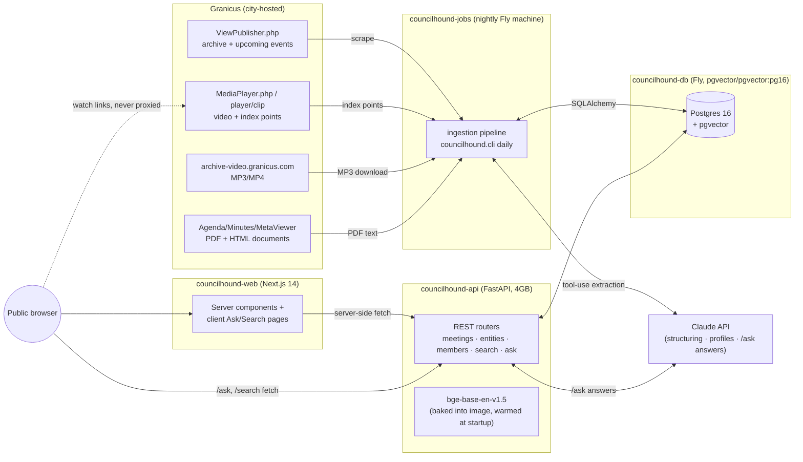
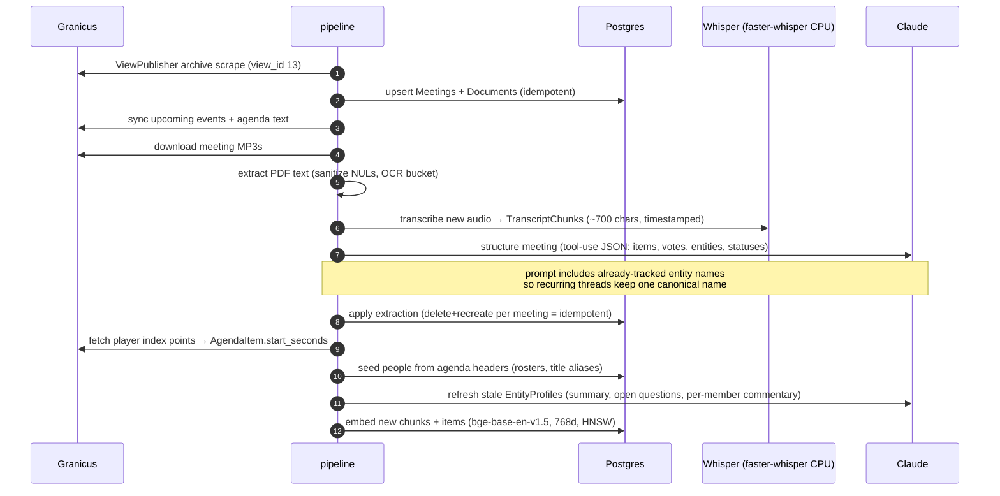
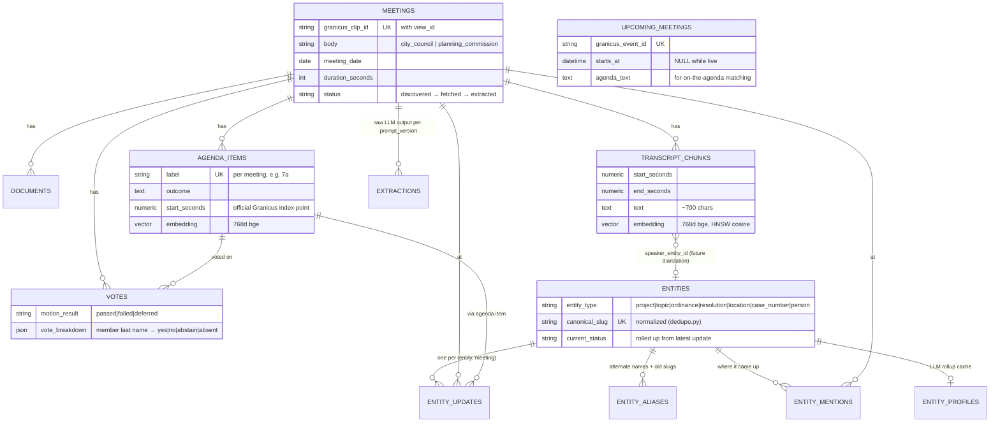
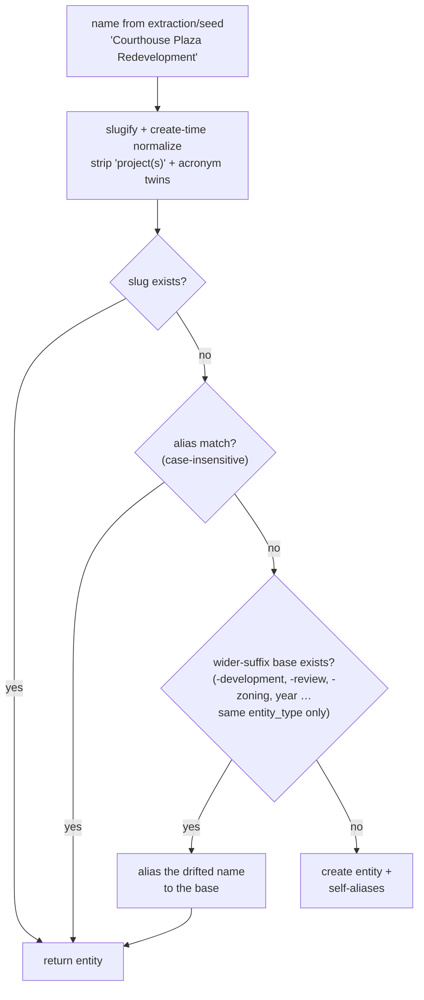
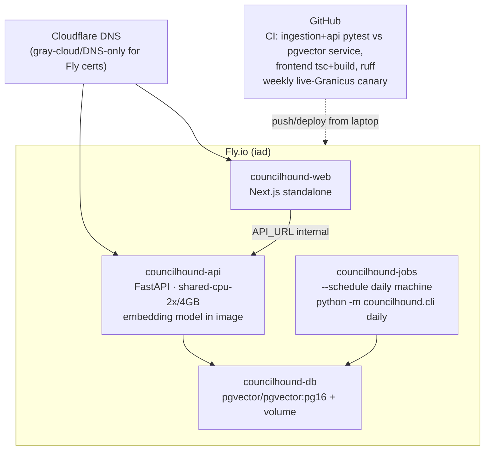

# CouncilHound architecture

How the system turns a Granicus meeting archive into a tracked, searchable,
askable knowledge base. Written July 2026 against the deployed system;
diagrams are Mermaid (GitHub renders them inline).

Companion docs: [PLAN.md](../PLAN.md) (original phased build plan),
[ROADMAP.md](../ROADMAP.md) (feature backlog), [README.md](../README.md)
(setup + adapting to another city).

## System overview

Two hard rules shape everything:

1. **Video is never hosted or embedded.** Every "watch" affordance is a deep
   link into the city's own player, seeked with `starttime` (legacy player)
   + `entrytime` (modern player) — see `api/app/links.py`.
2. **The LLM never owns identity.** Extraction emits *names*; code resolves
   names to entities (`entities.resolve_entity`) and code merges duplicates
   (`dedupe.py`). An LLM output can never create or collapse identity on
   its own.

## Ingestion pipeline (nightly `cli daily`)

Every stage is idempotent and independently runnable via the CLI
(`discover`, `ingest`, `extract-text`, `transcribe`, `structure`,
`index-points`, `seed-entities`, `profile`, `embed`, `upcoming`,
`dedupe-entities`, `merge-entity`, `status`). `daily` chains them; the
scheduled machine boots once a day, runs it, and stops.

Transcription backends: `mlx-whisper` on Apple-Silicon dev machines
(~35x realtime on GPU), `faster-whisper` (distil-large-v3) on the CPU cloud
machine. Granicus caption files exist but are empty, so transcription is
mandatory, and canceled-meeting clips are skipped (title-card music makes
Whisper hallucinate).

## Data model

Not shown: `upcoming_meetings` is standalone (fully refreshed each sync —
past events graduate into real `meetings` via the archive), and
`ingest_runs` records per-run bookkeeping.

### Entity identity & dedup

Three reinforcing layers keep one real-world thread = one entity:
resolve-time normalization (above), the extraction prompt listing
already-tracked names to reuse, and `merge-entity`/`dedupe-entities` for
anything that slips through — merges move all history and leave the old
name *and slug* as aliases, so old URLs redirect (the API falls back to
alias lookup on slug miss).

## Query surfaces

| Surface | Path | How it works |
|---|---|---|
| Briefing | `/` | recent decisions derived from meeting details (procedural noise filtered); 30-day stat tiles; Next up (upcoming events); per-body hot panels |
| Hot topics | `/entities/hot` | named discussion time = Σ durations of transcript chunks whose text contains an entity name/alias, windowed by days + body; deterministic, no LLM |
| Topic page | `/entities/{slug}` | status stepper + provenance, profile (LLM cache), vote pills, discussion sparkline, related-by-co-mention, upcoming-agenda flags, full timeline with watch links |
| Members | `/members` | roster = people with title aliases; current vs former parsed from each body's latest agenda header; votes matched by the breakdown's last-name keys |
| Ask | `/ask` | embed question (bge, query prefix) → pgvector cosine top-K over chunks+items → Claude answers from numbered sources only → markdown with [n] citations linking to sources |
| Search | `/search` | hybrid: trigram keyword match + pgvector semantic match over chunks and items, merged with source labels |

`/ask` is the only LLM-per-request endpoint and is defended by a per-IP
sliding window plus a global daily budget (in-memory — the API runs as a
single instance; see `api/app/ratelimit.py`).

## Deployment

Operational notes (learned the hard way):

- **Fly managed Postgres lacks pgvector** — hence the self-run
  `pgvector/pgvector:pg16` machine with a volume.
- **The API must preload the embedding model** in the FastAPI lifespan;
  torch import + model load (~20s on shared CPU) otherwise stampedes with
  health checks on first `/ask` and looks hung. 4GB is the floor.
- **Jobs deploys never run `flyctl deploy`** against the app (it would
  clobber the scheduled machine's command back to the placeholder). Build
  with `flyctl deploy -c ingestion/fly.toml --build-only --push
  --image-label <tag> .` from `ingestion/`, then
  `flyctl machine update <id> --image … -y` (schedule + command survive).
  One-off admin (migrations, backfills, merges) runs the same image via
  `flyctl machine run … --rm -- python -m councilhound.cli <cmd>` — secrets
  ride along, credentials never leave Fly.
- **Watch deploy exit codes** — piping flyctl output through `tail` masks
  failures (a depot-builder auth 401 once looked like a successful deploy).
- **Migrations**: Alembic; `cli init-db` upgrades to head. Local dev uses
  an embedded pgserver Postgres when `DATABASE_URL` is unset (engine init
  is lock-guarded — concurrent first requests once raced pg_ctl).
- **Granicus quirks**: requests need a browser User-Agent (bare curl gets
  403); `MediaPlayer.php` redirects to `/player/clip/…` preserving the
  query string; only `entrytime` seeks the modern player; the weekly canary
  workflow catches markup drift under a green unit-test suite.
